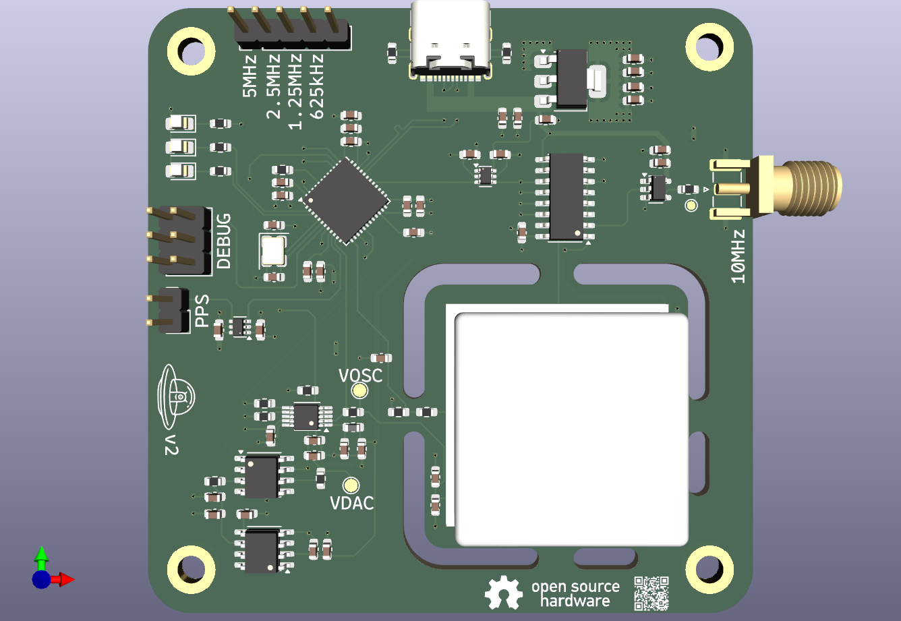

# GPSDO

**GPSDO** (GPS Disciplined Oscillator) combines the precision of a high-quality OCXO (Oven-Controlled Crystal Oscillator) with the pulse-per-second (PPS) signal from a GNSS receiver. The goal is to achieve accurate time and frequency reference, down to the nanosecond level.

This project aims to create an **open-source and affordable** GPSDO from scratch, including designing custom hardware (PCB) and developing the supporting software.

# Features
* Combines GNSS PPS with a high-precision OCXO
* Fully open-source hardware and software
* Targeting nanosecond-level timing precision
* Modular design for hardware and software development

# Status
🚧 Under Construction

The first hardware prototype is currently being tested; all findings are documented in Issue #1

# Roadmap

✅ Improve hardware based on findings from V2 prototype  
🔄 Integrate the GNSS receiver on-board for a fully standalone GPSDO  
⚙️ Fine-tune the control loop and filtering algorithms  
📊 Benchmark the true performance against reference standards  

# Contributing
Contributions are welcome! Whether it's hardware design suggestions, software improvements, or analysis scripts, feel free to open an issue or a pull request.

## Compiling flatcc (Windows)
* Navigate into `flatcc` submodule folder.  
* Create `build` folder
* Navigate into `build` folder
* Run `cmake ..`
* Run `cmake --build . --config Release`
* Executable is in `flatcc/bin/Release/flatcc.exe`
